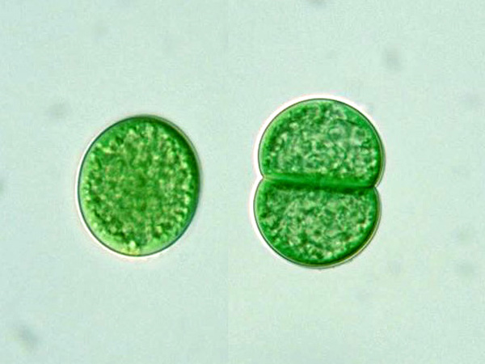

# planktonPipeline

## How to use it ?
- Download the planktonPipeline folder
- Place the Cytoclus data (pulse and listmodes files) in the folder of your choice (data_source) and chose a destination folder (data_destination).
- Change the paths to data_source and data_destination with yours in main.py
- Run main.py 
